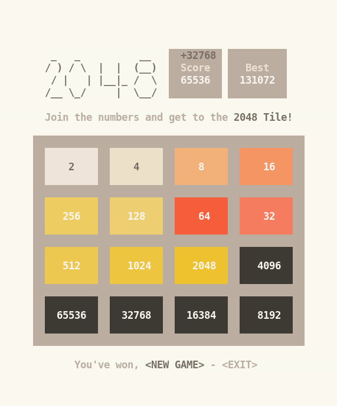

# Ansi2048

Ansi2048 is a Unix terminal version of the game [2048](https://github.com/gabrielecirulli/2048), written in Python that utilizes ansi escape sequences to render the graphics of the game.

## Features

- Ansi Escape Sequences
- [Translated in 107 languages](https://translate.google.com/)
- Different color depths
- Vim, cursor and gaming keys
- Fully customizable

## Requirements

- Unix like system
- Support to ansi escape sequences
- Python >= 3.9
- [wcwidth](https://github.com/jquast/wcwidth)

# Play

`python3 ~/Ansi2048/2048/main.py`

same as 

`python3 ~/Ansi2048/2048/main.py -r=4 -c=4 -wt=2048 -hp=2 -vp=1 -trn=3 -tcn=9 -l=en -bd=4`

## [Movement keys](https://en.wikipedia.org/wiki/Arrow_keys)

`
- h j k l 	Vim
- w a s d 	Gaming
- ↑ ← ↓ → 	Cursor
- q or ctrl-c	Exit game`

## Options
`
- -h,   --help         → show this help message and exit
- -v,   --version      → show program's version number and exit
- -r,   --rows         → rows of the board (default: 4)
- -c,   --columns      → columns of the board (default: 4)
- -wt,  --wintile      → tile to win (default: 2048)
- -hp,  --horpad       → hor. padding in the tiles (default: 2)
- -vp,  --verpad       → ver. padding in the tiles (default: 1)
- -trn, --tilerowsn    → rows that each tile has in graphical board (default: 3)
- -tcn, --tilecolumnsn → columns that each tile has in graphical board (default: 9)
- -l,   --lang         → system language (default: en)
- -bd,  --bitdepth     → color depth -> 1bit, 3bit, 4bit, 8bit, 24bit (default: 4)`

## Made by [Sivefunc](https://gitlab.com/sivefunc)
## Licensed under [GPLv3](LICENSE)
